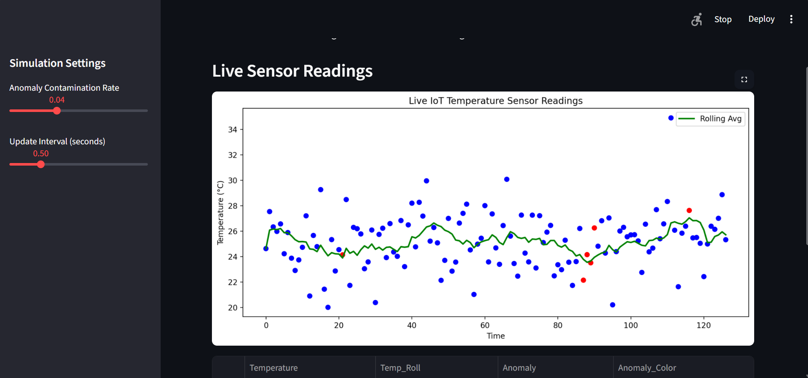

# 📡 Real-Time IoT Temperature Anomaly Detection

An interactive dashboard that simulates real-time IoT sensor data and detects temperature anomalies using Machine Learning (Isolation Forest). Designed to demonstrate data streaming, anomaly detection, and interactive visualization skills — all in one.

---

## 🌐 Live Demo

Check out the interactive dashboard here: [Live App](https://share.streamlit.io/your-username/iot-anomaly/main/app.py)

## 🚀 Features

- 🔹 Real-time IoT data simulation
- 🔹 Automatic ML anomaly detection (Isolation Forest)
- 🔹 Clean visual dashboard with highlighted anomalies
- 🔹 Downloadable anomaly report (CSV)
- 🔹 Adjustable contamination and update frequency
- 🔹 Built with Streamlit
---

## 🧠 What This Project Demonstrates

| Skill Category | Skills Shown |
|----------------|--------------|
| Programming | Python, OOP basics |
| Data | Pandas, NumPy, Real-time Streaming |
| Machine Learning | Feature Engineering, Unsupervised Learning |
| Visualization | Matplotlib, Streamlit UI Components |
| Deployment Prep | GitHub repo structure, documentation |

---

## 🛠️ Technologies Used

- Python
- Streamlit
- Scikit-learn
- Pandas / NumPy
- Matplotlib

---

## 📂 Project Structure
│app.py

│requirements.txt

│README.md 

│.gitignore 

└── screenshots

└── demo.gif 

## 📸 Screenshots / GIF




---

## ▶ How to Run the Project locally

### 🧩 1️⃣ Install Dependencies

```bash
pip install -r requirements.txt


## 👤 Author

**Mellen Atwine**  
Aspiring Data Scientist & Electrical Engineer  
📧 mellenatwine151@gmail.com  
🔗 [GitHub](https://github.com/mellenatwine-png) | [LinkedIn](www.linkedin.com/in/mellen-atwine-32708b206)
